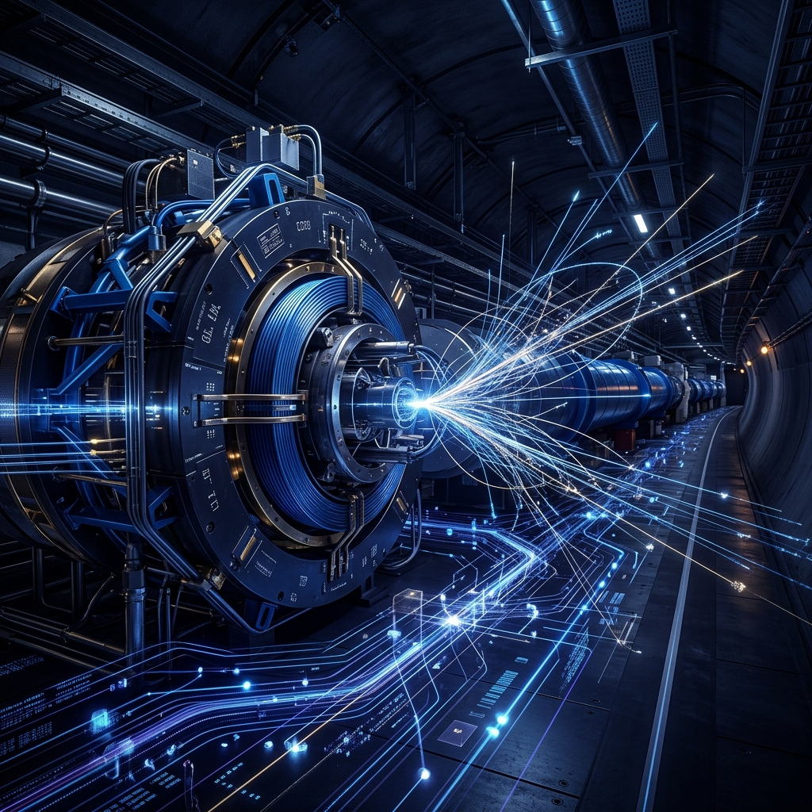

# 🌌 Awesome CERN Engineering

**İnsanlık tarihinin teknik açıdan en ileri düzeyi: Büyük Hadron Çarpıştırıcısı (LHC) ve CERN ekosistemindeki mühendislik disiplinlerinin derinlemesine incelendiği, yüksek yoğunluklu teknik dökümantasyon ve kaynak kataloğu.**

---

## 🏛️ Yönetici Özeti (Executive Summary)

CERN (Avrupa Nükleer Araştırma Merkezi), modern bilişim ve mühendislik dünyasının sınırlarını belirleyen bir ekosistemdir. Bu depo, CERN'ü yalnızca bir teorik fizik laboratuvarı olarak değil; **Radyo Frekans (RF) Sistemleri, Kriyojenik mimari, Ultra-Hızlı Veri İşleme (DAQ), Dağıtık Hesaplama (Grid Computing) ve Fail-Safe Kontrol Sistemleri** özelinde bir mühendislik manifostosu olarak ele almaktadır. 

Buradaki temel amaç, dünyanın en karmaşık makinesinin arkasındaki mimari prensipleri analiz ederek, bu disiplinleri otonom sistemler, savunma sanayii ve ileri seviye yazılım projelerine adapte edebilecek bir teknik perspektif sunmaktır.

> 💡 **Tarihsel Bağlam:** CERN'ün 29 Eylül 1954'teki kuruluşu ve takriben bir yıl sonra, 18 Nisan 1955'te modern fiziğin öncüsü **Albert Einstein**'ın vefatı, bilimsel bayrağın teoriden eyleme ve deneysel mühendisliğe geçtiği sembolik bir eşik olarak kabul edilmektedir.

---

## 🏛️ Bilimsel Kilometre Taşları ve Keşif Paradigmaları

CERN tarihinde, evrenin temel yasalarını yeniden tanımlayan ve mühendislik sınırlarını zorlayan kritik bilimsel dönüm noktaları bulunmaktadır:

### 1. Nötr Akımların Keşfi ve Elektrozayıf Doğrulama (1973)
*Gargamelle* ağır sıvı kabarcık odası (bubble chamber), zayıf etkileşimlerin nötr bir aracı parçacık (Z bozonu) vasıtasıyla gerçekleştiğini kanıtlayarak elektrozayıf teoriyi doğrulamıştır.
*   **Teknik Mimari:** 4.8 metre uzunluğunda ve 2 metre çapındaki silindirik tank, 12 metreküp sıvı Freon ($CF_3Br$) ile doldurulmuştur. Freon'un yüksek yoğunluğu, nötrino etkileşim olasılığını maksimize etmiştir.
*   **Mühendislik Dinamiği:** Dedektör, 2-Tesla gücünde bir manyetik alan üreten devasa bir mıknatıs ile çevrelenmiştir. Nötrinoların doğrudan iz bırakmaması nedeniyle, keşif, etkileşim sonrası fırlayan ikincil parçacıkların izlerinin mikroskobik analiziyle mümkün olmuştur.

### 2. UA1/UA2 ve W/Z Bozonlarının Tespiti (1983)
Zayıf kuvvetin taşıyıcıları olan W ve Z bozonlarının keşfi, Standart Model'in en büyük zaferlerinden biri olarak kabul edilir.
*   **Accelerator Modifikasyonu:** Keşif için Süper Proton Sinkrotronu (SPS), tarihte ilk kez bir proton-antiproton çarpıştırıcısına (SppS) dönüştürülmüştür.
*   **Stochastic Cooling:** Nobel ödüllü Simon van der Meer tarafından geliştirilen bu teknoloji, antiproton demetlerini "sıkarak" odaklamış ve çarpışma olasılığını milyarlarca kat artırmıştır.
*   **Dedektör Farklılıkları:** 
    *   **UA1:** 5.8 m uzunluğunda, 0.7-Tesla manyetik alanlı kompleks bir görüntüleme odasıdır.
    *   **UA2:** Daha çok yüksek hassasiyetli elektromanyetik ve hadronik kalorimetrelere odaklanarak enerji ölçümü üzerine uzmanlaşmıştır.

### 3. World Wide Web (WWW) ve Dağıtık Bilgi Mimarisi (1989)
Tim Berners-Lee tarafından geliştirilen protokoller, CERN'ün küresel veri paylaşım ihtiyacını karşılamak üzere tasarlanmıştır.
*   **Donanım Platformu:** İlk web sunucusu, bir **NeXTcube** iş istasyonu üzerinde çalıştırılmıştır. Bu makine ilk HTTP sunucu yazılımı, URL sözdizimi ve HTML formatına ev sahipliği yapmıştır.
*   **Teknik Miras:** CERN, 30 Nisan 1993'te web yazılımını kamu malı (public domain) ilan ederek küresel internet devrimini tetiklemiştir.

### 4. Antimadde Sentezi ve ALPHA Deneyi (1995-2010)
CERN, antimaddenin üretilmesi, depolanması ve spektroskopik analizi konusunda dünyadaki tek merkezdir.
*   **AD (Antiproton Decelerator):** Protonları yavaşlatarak "soğuk" antiprotonlar elde eden özelleşmiş bir yavaşlatıcı halkadır.
*   **ALPHA Deneyi:** Anti-hidrojen atomlarını 1000 saniyeden fazla (2011 rekoru) manyetik tuzaklarda tutmayı başarmıştır. 
*   **Sympathetic Cooling:** Manyetik tuzak içindeki pozitron plazmalarını lazerle soğutulmuş baryum iyonları kullanarak soğutma tekniği, antimadde üretim verimliliğini 8 kat artırmıştır.

### 5. Higgs Bozonu ve Skaler Alanın Kanıtlanması (2012)
Higgs alanının varlığı, ATLAS ve CMS deneylerinin bağımsız verileriyle doğrulanmıştır.
*   **Golden Channels:** Keşif, özellikle $H \to \gamma\gamma$ (iki foton) ve $H \to ZZ^* \to 4\ell$ (dört lepton) bozunma kanallarındaki yüksek sinyallerle elde edilmiştir.
*   **Analitik Güç:** Parçacığın kütlesi yaklaşık **125.09 GeV** olarak belirlenmiştir. Bu keşif için gereken $5\sigma$ (beş sigma) istatistiksel güvenilirlik eşiği, WLCG Grid sistemi üzerinde işlenen Petabaytlarca ham veri ile aşılmıştır.

---

---

## 🗺️ Teknik Mimari ve İçerik Haritası

1.  [Parçacık Hızlandırıcı Zinciri ve RF Sistemleri](#1-parçacık-hızlandırıcı-zinciri-ve-rf-sistemleri)
2.  [Kriyojenik ve Süperiletken Manyetik Mimariler](#2-kriyojenik-ve-süperiletken-manyetik-mimariler)
3.  [Veri Toplama (DAQ) ve Donanım Tabanlı Triggering](#3-veri-toplama-daq-ve-donanım-tabanlı-triggering)
4.  [Kontrol Sistemleri ve Görev-Kritik Güvenlik (Security by Design)](#4-kontrol-sistemleri-ve-görev-kritik-güvenlik-security-by-design)
5.  [WLCG: Küresel Dağıtık Hesaplama Analitiği](#5-wlcg-küresel-dağıtık-hesaplama-analitiği)
6.  [Açık Kaynak Standartları ve Endüstriyel Miras](#6-açık-kaynak-standartları-ve-endüstriyel-miras)
7.  [Egzotik ve Esoteric Hesaplamalı Modeller](#7-egzotik-ve-esoteric-hesaplamalı-modeller)
8.  [İleri Fizik Simülasyonları ve Karşılaştırmalı Kinematik](#8-ileri-fizik-simülasyonları-ve-karşılaştırmalı-kinematik)
9.  [Karanlık Madde (Dark Matter) Tespit Metodolojileri](#9-karanlık-madde-dark-matter-tespit-metodolojileri)

---

## 🚀 1. Parçacık Hızlandırıcı Zinciri ve RF Sistemleri

Parçacıkların durağan halden rölativistik hızlara ($0.999999991c$) ulaştırılması, katmanlı bir hızlandırıcı mimarisini zorunlu kılmaktadır.

*   **LINAC 4:** Başlangıç evresi olan doğrusal hızlandırıcıdır. Protonlar $160$ MeV enerji seviyesine çıkarılarak dairesel yapıya enjekte edilir.
*   **PS & SPS (Synchrotron Kadrosu):** Enjeksiyonun ardından parçacık demetleri, trilyon elektronvolt (TeV) seviyelerine kadar ivmelendirilerek nihai çarpıştırma halkasına (LHC) aktarılır.
*   **RF Boşlukları (RF Cavities):** Parçacıkları "itmeyen" ancak elektromanyetik alan sörfü yaptırarak hızlandıran bu üniteler, milisaniye hassasiyetli faz senkronizasyonu ile çalışmaktadır.

## ❄️ 2. Kriyojenik ve Süperiletken Manyetik Mimariler

LHC'nin operasyonel sürekliliği, dünyanın en büyük kriyojenik ağının saniyede tonlarca süperakışkan helyumu transfer etmesine bağlıdır.

*   **1.9 Kelvin Operasyon Sınırı:** Süperiletkenliğin tesisi için sistem, mutlak uzay sıcaklığından daha düşük olan **-271.3 °C** seviyesinde sabitlenmiştir.
*   **NbTi Süperiletkenler:** 1232 ana dipol mıknatıs, içinden geçen $11,850$ Amper akım sayesinde $8.3$ Tesla gücünde manyetik alan üreterek demetin yörüngede kalmasını sağlar.

## 📊 3. Veri Toplama (DAQ) ve Donanım Tabanlı Triggering

Saniyede 40 milyon çarpışmanın gerçekleştiği dedektörlerde, verinin süzülmesi ve ön işlenmesi klasik mimarilerin ötesinde bir performans gerektirir.

*   **L1 Trigger (Hardware-level):** Custom FPGA ve ASIC tasarımları aracılığıyla mikrosaniye düzeyinde eleme yapılarak veri hızı $40$ MHz'den $100$ kHz'e düşürülür.
*   **HLT (High-Level Trigger):** Yazılımsal çiftlikler (Server Farms) üzerinden saniyede sadece $1000$ "ilginç" olay depolama sistemlerine aktarılmasıyla veri orkestrasyonu sağlanır.
*   **Edge-AI Entegrasyonu:** Verinin dedektör seviyesinde anlık analiz edilmesi için **hls4ml** gibi araçlarla donanım düzeyinde yapay zeka entegre edilmiştir.

## 🛡️ 4. Kontrol Sistemleri ve Görev-Kritik Güvenlik (Security by Design)

Yüksek enerji yoğunluğuna sahip bir ortamda hata toleransı, tasarımsal bir zorunluluktur.

*   **Beam Interlock System (BIS):** Herhangi bir donanımsal sapmada (Quench vb.) demetin mikrosaniyeler içinde gğvenli bölgeye (dump) tahliyesini sağlayan sinir sistemi mimarisidir.
*   **Rad-Hard Electronics:** Radyasyon etkisiyle oluşabilecek Single-Event Upset (SEU) hatalarını önlemek amacıyla özel yalıtımlı çipler ve Triple Modular Redundancy (TMR) protokolleri uygulanmaktadır.

## 🌐 5. WLCG: Küresel Dağıtık Hesaplama Analitiği

Dünya geneline yayılan **Worldwide LHC Computing Grid**, 42 ülkedeki 170 veri merkezini tek bir sanal süper-bilgisayara dönüştürür.

*   **Tier Hiyerarşisi:** Kalıcı depolamadan (Tier 0), bölgesel analiz merkezlerine (Tier 1) ve akademik uç noktalara (Tier 2) kadar sistematik veri dağıtımı.
*   **Infrastructure as Code:** Yıllık $25$ PB üzerinde verinin yönetimi, orkestrasyonu ve job scheduler mekanizmaları.

## 🛠️ 6. Açık Kaynak Standartları ve Endüstriyel Miras

CERN, geliştirdiği teknolojileri açık donanım (OHL) ve yazılım lisanslarıyla endüstriye kazandırmaktadır.

| Teknoloji / Araç | Uygulama Alanı | Mühendislik Rolü |
| :--- | :--- | :--- |
| **ROOT** | Big Data & Analiz | Nesne yönelimli, C++ tabanlı veri analiz çerçevesi. |
| **Geant4** | Simülasyon | Monte Carlo metodolojisi ile parçacık-madde etkileşimi modelleme. |
| **KiCad** | PCB Dizayn | Profesyonel seviyede açık kaynak elektronik devre tasarımı. |
| **White Rabbit** | Senkronizasyon | Alt-nanosaniye hassasiyetli Ethernet tabanlı zaman transferi (PTP). |

## 👽 7. Egzotik ve Esoteric Hesaplamalı Modeller

CERN'ün uç fiziğine sembolik bir eşlikçi olarak, alışılmadık programlama paradigmalrıyla geliştirilen modeller.
*   **APL (A Programming Language):** Vektörel ve matris tabanlı yapısıyla, ışık hızına yaklaşan protonların rölativistik dinamikleri için geliştirilmiş [özel simülasyon](file:///g:/Diğer bilgisayarlar/Dizüstü Bilgisayarım/github repolarım/awesome-cern-engineering/07_Exotic_Simulations/lorentz_factor.apl).

## 🧮 8. İleri Fizik Simülasyonları ve Karşılaştırmalı Kinematik

Deneysel süreçlerin doğrulanması için geliştirilmiş matematiksel kütüphaneler.
*   **Four-Vector Kinematics:** 13.6 TeV çarpışma kütlesini ve enerji korunumunu simüle eden [Python](file:///g:/Diğer bilgisayarlar/Dizüstü Bilgisayarım/github repolarım/awesome-cern-engineering/08_Advanced_Simulations/collision_kinematics.py) ve [APL](file:///g:/Diğer bilgisayarlar/Dizüstü Bilgisayarım/github repolarım/awesome-cern-engineering/08_Advanced_Simulations/collision_kinematics.apl) implementasyonları.

## 🌌 9. Karanlık Madde (Dark Matter) Tespit Metodolojileri

Görülebilir evrenin ötesindeki kütlenin tespiti için uygulanan hassas ölçüm disiplinleri.
*   **Missing Energy Signature:** Bilinen tüm parçacıkların momentum analizinden hareketle görünmeyen maddenin izini sürme stratejisi.
*   **Aksiyon Arayışları (CAST):** Güneş aksiyonlarının 9 Tesla manyetik alan altında X-ışınına dönüşümü (Primakoff Etkisi).
*   **Hassas Zamanlama:** 30 ps çözünürlüklü silikon dedektörlerin inşası ve sinyal analizi.

---

## 📚 Kaynakça ve Referans Dokümanlar

*   [CERN Engineering Design Process & Standards](https://edms.cern.ch/)
*   [LHC Design Report - Technical Volume](https://ab-div.web.cern.ch/ab-div/Publications/LHC-DesignReport.html)
*   [CERN Open Data Portal](https://opendata.cern.ch/)

---

## 🛸 Epistemolojik Not: Mizah ve Şehir Efsaneleri

Kurumsal büyüklüğün getirdiği anonim anlatılar, mühendislik disiplininin kültürel bir yansıması olarak değerlendirilmektedir. Popüler bir rivayete göre; dünyayı ziyarete gelen dünya dışı bir medeniyetin, yeraltındaki 27 km'lik mühendislik harikasını gözlemledikten sonra **"Bunu yapan bir medeniyet karşısında şansımız olamaz"** diyerek sessizce galaksilerine geri döndüğü anlatılmaktadır. Bu anlatı, CERN'deki insan dehasının ulaştığı sınırları ironik bir şekilde vurgulamaktadır.

---

### 🤝 Katkıda Bulunma Prensipleri
Teknik dökümantasyonun geliştirilmesi, sistem mimarileri, veri işleme metodolojileri veya donanım tasarımları üzerine literatür katkısında bulunmak isterseniz, lütfen yapılandırılmış bir **Pull Request** aracılığıyla iletişime geçiniz.
