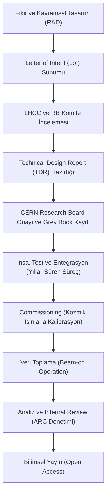

# 🌌 Awesome CERN Mühendisliği

**İnsanlık tarihinin teknik açıdan en ileri düzeyi: Büyük Hadron Çarpıştırıcısı (LHC) ve CERN ekosistemindeki mühendislik disiplinlerinin derinlemesine incelendiği, yüksek yoğunluklu teknik dökümantasyon ve kaynak kataloğu.**

---

## 🏛️ Yönetici Özeti (Executive Summary)

CERN (Avrupa Nükleer Araştırma Merkezi), modern bilişim ve mühendislik dünyasının sınırlarını belirleyen bir ekosistemdir. Bu depo, CERN'ü yalnızca bir teorik fizik laboratuvarı olarak değil; **Radyo Frekans (RF) Sistemleri, Kriyojenik mimari, Ultra-Hızlı Veri İşleme (DAQ), Dağıtık Hesaplama (Grid Computing) ve Fail-Safe Kontrol Sistemleri** özelinde bir mühendislik manifestosu olarak ele almaktadır. 

Buradaki temel amaç, dünyanın en karmaşık makinesinin arkasındaki mimari prensipleri analiz ederek, bu disiplinleri otonom sistemler, savunma sanayii ve ileri seviye yazılım projelerine adapte edebilecek bir teknik perspektif sunmaktır.

> 💡 **Tarihsel Bağlam:** CERN'ün 29 Eylül 1954'teki kuruluşu ve takriben bir yıl sonra, 18 Nisan 1955'te modern fiziğin öncüsü **Albert Einstein**'ın vefatı, bilimsel bayrağın teoriden eyleme ve deneysel mühendisliğe geçtiği sembolik bir eşik olarak kabul edilmektedir.

---

## 🛠️ LHC Deney Yaşam Döngüsü: Fikirden Yayına

CERN'deki bir bilimsel deney, kavramsal tasarımdan veri analizine kadar yıllar süren, çok katmanlı ve disiplinli bir dökümantasyon ve onay sürecine tabidir.

### 🔄 Operasyonel Akış Diyagramı

### 📋 Protokol Detayları

1.  **Teklif ve LoI (Letter of Intent):** Bilimsel bir topluluk (collaboration), hedeflenen fizik ölçümü için kavramsal bir taslak hazırlar ve deneyi yürütmek amacıyla CERN'e başvurur.
2.  **TDR (Technical Design Report):** Deneyin dedektör mimarisi, mühendislik gereksinimleri, bütçe planlaması ve iş gücü dağılımını içeren binlerce sayfalık teknik manifestodur.
3.  **Hukuki Çerçeve (MoU):** Katılımcı kurumlar ve CERN arasında kaynak taahhütlerini belirleyen *Memorandum of Understanding* imzalanır.
4.  **Commissioning:** Dedektör yeraltına kurulduktan sonra, demet gelmeden önce kozmik ışınlar kullanılarak tüm sensörlerin zamanlama ve konum kalibrasyonları yapılır.
5.  **ARC (Analysis Review Committee):** Ham veri işlendikten sonra elde edilen sonuçlar, işbirliği içindeki bağımsız bir hakem heyeti (ARC) tarafından "blind review" metodolojisiyle denetlenmeden yayınlanamaz.

---

## 🏛️ Bilimsel Kilometre Taşları ve Keşif Paradigmaları

CERN tarihinde, evrenin temel yasalarını yeniden tanımlayan ve mühendislik sınırlarını zorlayan kritik bilimsel dönüm noktaları bulunmaktadır:

### 1. Nötr Akımların Keşfi ve Elektrozayıf Doğrulama (1973)
*Gargamelle* ağır sıvı kabarcık odası (bubble chamber), zayıf etkileşimlerin nötr bir aracı parçacık (Z bozonu) vasıtasıyla gerçekleştiğini kanıtlayarak elektrozayıf teoriyi doğrulamıştır.
*   **Teknik Mimari:** 4.8 metre uzunluğunda ve 2 metre çapındaki silindirik tank, 12 metreküp sıvı Freon ($CF_3Br$) ile doldurulmuştur. Freon'un yüksek yoğunluğu, nötrino etkileşim olasılığını maksimize etmiştir.
*   **Mühendislik Dinamiği:** Dedektör, 2-Tesla gücünde bir manyetik alan üreten devasa bir mıknatıs ile çevrelenmiştir.

### 2. UA1/UA2 ve W/Z Bozonlarının Tespiti (1983)
*   **Accelerator Modifikasyonu:** Keşif için Süper Proton Sinkrotronu (SPS), tarihte ilk kez bir proton-antiproton çarpıştırıcısına (SppS) dönüştürülmüştür.
*   **Stochastic Cooling:** Nobel ödüllü Simon van der Meer tarafından geliştirilen bu teknoloji, antiproton demetlerini "sıkarak" odaklamış ve çarpışma olasılığını milyarlarca kat artırmıştır.

### 3. World Wide Web (WWW) ve Dağıtık Bilgi Mimarisi (1989)
*   **Donanım Platformu:** İlk web sunucusu, bir **NeXTcube** iş istasyonu üzerinde çalıştırılmıştır. Bu makine ilk HTTP sunucu yazılımı, URL sözdizimi ve HTML formatına ev sahipliği yapmıştır.

### 4. Antimadde Sentezi ve ALPHA Deneyi (1995-2010)
*   **AD (Antiproton Decelerator):** Protonları yavaşlatarak "soğuk" antiprotonlar elde eden özelleşmiş bir yavaşlatıcı halkadır.
*   **Sympathetic Cooling:** Manyetik tuzak içindeki pozitron plazmalarını lazerle soğutulmuş baryum iyonları kullanarak soğutma tekniği, antimadde üretim verimliliğini 8 kat artırmıştır.

### 5. Higgs Bozonu ve Skaler Alanın Kanıtlanması (2012)
*   **Golden Channels:** Keşif, özellikle $H \to \gamma\gamma$ (iki foton) ve $H \to ZZ^* \to 4\ell$ (dört lepton) bozunma kanallarındaki yüksek sinyallerle elde edilmiştir.
*   **Analitik Güç:** 125 GeV tespitindeki $5\sigma$ (beş sigma) istatistiksel güvenilirlik eşiği, WLCG Grid sistemi üzerinde işlenen Petabaytlarca ham veri ile aşılmıştır.

---

## 🗺️ Teknik Mimari ve İçerik Haritası

0.  [LHC Deney Yaşam Döngüsü: Fikirden Yayına](#-lhc-deney-yaşam-döngüsü-fikirden-yayına)
1.  [Parçacık Hızlandırıcı Zinciri ve RF Sistemleri](#1-parçacık-hızlandırıcı-zinciri-ve-rf-sistemleri)
2.  [Kriyojenik ve Süperiletken Manyetik Mimariler](#2-kriyojenik-ve-süperiletken-manyetik-mimariler)
3.  [Veri Toplama (DAQ) ve Donanım Tabanlı Tetikleme](#3-veri-toplama-daq-ve-donanım-tabanlı-tetikleme)
4.  [Kontrol Sistemleri ve Görev-Kritik Güvenlik (Tasarımsal Güvenlik)](#4-kontrol-sistemleri-ve-görev-kritik-güvenlik-tasarımsal-güvenlik)
5.  [WLCG: Küresel Dağıtık Hesaplama Analitiği](#5-wlcg-küresel-dağıtık-hesaplama-analitiği)
6.  [Açık Kaynak Standartları ve Endüstriyel Miras](#6-açık-kaynak-standartları-ve-endüstriyel-miras)
7.  [Egzotik Hesaplamalı Modeller](#7-egzotik-hesaplamalı-modeller)
8.  [İleri Fizik Simülasyonları ve Karşılaştırmalı Kinematik](#8-ileri-fizik-simülasyonları-ve-karşılaştırmalı-kinematik)
9.  [Karanlık Madde (Dark Matter) Tespit Metodolojileri](#9-karanlık-madde-dark-matter-tespit-metodolojileri)

---

## 🚀 1. Parçacık Hızlandırıcı Zinciri ve RF Sistemleri
Parçacıkların durağan halden rölativistik hızlara ($0.999999991c$) ulaştırılması, katmanlı bir hızlandırıcı mimarisini zorunlu kılmaktadır. [Dökümantasyon](01_Hizlandirici_ve_RF_Sistemleri/README.md).

## ❄️ 2. Kriyojenik ve Süperiletken Manyetik Mimariler
LHC'nin operasyonel sürekliliği, dünyanın en büyük kriyojenik ağının saniyede tonlarca helyumu transfer etmesine bağlıdır. [Dökümantasyon](02_Kriyojenik_ve_Superiletken_Miknatislar/README.md).

## 📊 3. Veri Toplama (DAQ) ve Donanım Tabanlı Tetikleme
Saniyede 40 milyon çarpışmanın gerçekleştiği dedektörlerde, verinin süzülmesi ve ön işlenmesi klasik mimarilerin ötesindedir. [Dökümantasyon](03_DAQ_ve_Tetikleme_Sistemleri/README.md).

## 🛡️ 4. Kontrol Sistemleri ve Güvenlik (Tasarımsal Güvenlik)
Yüksek enerji yoğunluğuna sahip bir ortamda hata toleransı tasarımsal bir zorunluluktur. [Dökümantasyon](04_Kontrol_ve_Guvenlik_Sistemleri/README.md).

## 🌐 5. WLCG: Küresel Dağıtık Hesaplama Analitiği
42 ülkedeki 170 veri merkezini tek bir sanal süper-bilgisayara dönüştüren küresel ağ. [Dökümantasyon](05_WLCG_ve_Dagitik_Hesaplama/README.md).

## 🛠️ 6. Açık Kaynak Standartları ve Endüstriyel Miras
CERN mimarları tarafından geliştirilen ve endüstriye kazandırılan açık kaynak araçlar. [Dökümantasyon](06_Acik_Kaynak_Teknolojiler/README.md).

## 👽 7. Egzotik Hesaplamalı Modeller
APL gibi alışılmadık programlama paradigmalarıyla geliştirilen fiziksel modeller. [Dökümantasyon](07_Egzotik_Simulasyonlar/README.md).

## 🧮 8. İleri Fizik Simülasyonları ve Kinematik
Python ve APL ile 13.6 TeV çarpışma kütlesini ve enerji korunumunu simüle eden araçlar. [Dökümantasyon](08_Gelismis_Simulasyonlar/README.md).

## 🌌 9. Karanlık Madde (Dark Matter) Tespit Metodolojileri
Görünmez olanı arayan "Missing Energy" sinyalleri ve Aksiyon teleskopları. [Dökümantasyon](09_Karanlik_Madde_Arastirmalari/README.md).

---

## 📚 Kaynakça ve Referans Dokümanlar

*   [CERN Mühendislik Tasarım Süreçleri](https://edms.cern.ch/)
*   [LHC Teknik Tasarım Raporu](https://ab-div.web.cern.ch/ab-div/Publications/LHC-DesignReport.html)
*   [CERN Açık Veri Portalı](https://opendata.cern.ch/)

---

## 🛸 Epistemolojik Not: Mizah ve Şehir Efsaneleri
Kurumsal büyüklüğün getirdiği anonim anlatılar, mühendislik disiplininin kültürel bir yansımasıdır. Uzaylıların CERN'ü görüp "Bunu yapanlara bulaşılmaz" diyerek geri döndüğü rivayeti, dehanın ulaştığı sınırları vurgulayan ironik bir anlatıdır.

---

### 🤝 Katkıda Bulunma Prensipleri
Teknik dökümantasyonun geliştirilmesi veya donanım tasarımları üzerine literatür katkısında bulunmak isterseniz, lütfen bir **Pull Request** aracılığıyla iletişime geçiniz.
